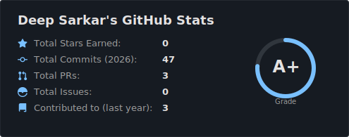
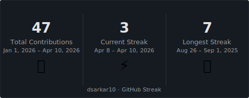
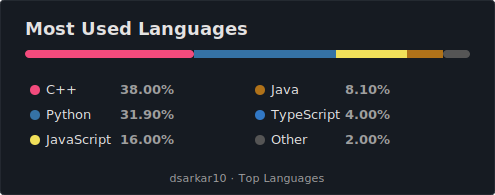

# Hey, I'm Deep Sarkar 👋

## Backend & Systems Engineer · NIT Rourkela · Backend Developer · Opensource Contributor 

🎓 B.Tech @ NIT Rourkela &nbsp;|&nbsp; 🌍 India &nbsp;|&nbsp; 🔭 Currently exploring AI agents & systems design

Building high-performance, real-time distributed systems —
from **low-latency C++ matching engines** to **MLOps pipelines**.
Freelance backend developer with production experience serving **2,000+ concurrent users**.
Competitive programmer — **Top 15% Meta Hacker Cup 2024**.

---

## 🌐 Socials

---

## 🚀 Pinned Projects

| Project | Stack | What it does |
|--------|-------|--------------|
| [**low-latency-matching-engine**](https://github.com/deepsr2003/low-latency-matching-engine) | C++17, mmap, Bitmaps | HFT-style order book — 70x throughput gain, sub-100ms latency via lock-free pools + compiler intrinsics |
| [**real-time-fraud-pipeline**](https://github.com/deepsr2003/real-time-fraud-pipeline) | Python, XGBoost, Kafka, Grafana | End-to-end MLOps pipeline detecting fraudulent transactions with millisecond-level inference |
| [**nexus-pipe-analytics**](https://github.com/deepsr2003/nexus-pipe-analytics) | Node.js, Python, Kafka, Redis | Distributed fault-tolerant event pipeline with real-time dashboards and WebSocket query API |
| [**architect**](https://github.com/deepsr2003/architect) | Python, CrewAI, Groq, FastAPI | Multi-agent SDLC automator — turns business objectives into full technical specs via Llama-3.3-70B |
| [**fama-french-replication**](https://github.com/deepsr2003/fama-french-replication) | Python, Pandas, Statsmodels | Quant finance — replicates SMB & HML factors with statistical analysis on 2015–2023 market data |
| [**spring-crypto-price-tracker**](https://github.com/deepsr2003/spring-crypto-price-tracker) | Java 25, Spring Boot, WebSockets | Real-time crypto price streaming via STOMP WebSockets + CoinMarketCap API |

---

## 💻 Tech Stack

**Languages**

**Hosting / SaaS**

**Frameworks, Platforms & Libraries**

**Servers & Messaging**

**Databases**

**ML / DL**

**CI/CD & DevOps**

---

## 📊 GitHub Stats

---

## 🏆 Achievements

- 🥇 **Meta Hacker Cup 2024** — Top 15% Global (Rank 7,647 Round 1 · 1,092nd Practice Round) out of 50,000+ programmers
- 🌍 **Google Developer Groups Solution Challenge 2025** — Selected for AI-powered disaster management solution
- 📈 **Codeforces** — Top 1% globally (125/ 10k+) in Div. 2 rounds
- 🎓 **Technical Mentor** — Guided 50+ junior developers in distributed systems & backend architecture at NIT Rourkela

---

*by — [dsarkar10](https://github.com/dsarkar10)*

